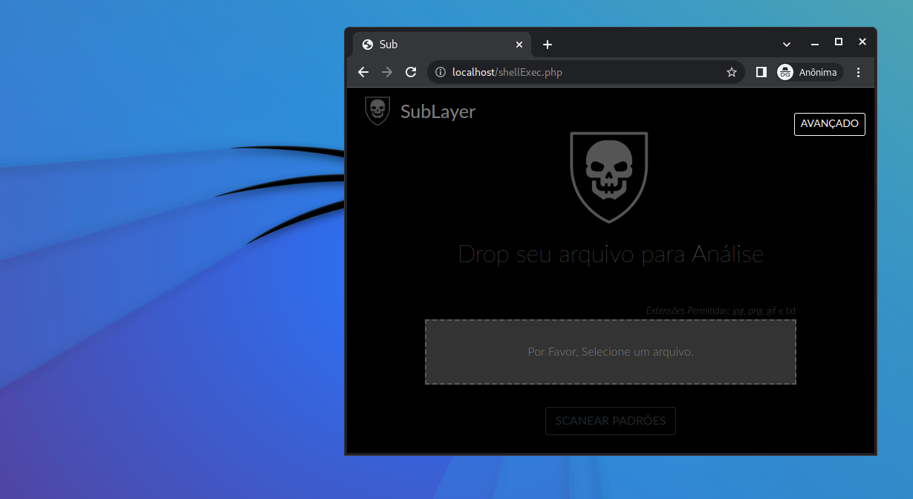

# SubLayer
Scan de padrões com Yara   
[]()    
  
> [By](https://github.com/le0henr1que/ "le0henr1que")  

### Download:  
```
galactus@dyson:~$ git clone https://github.com/le0henr1que/ScanMalware.git 
```

```
galactus@dyson:~$ cd ScanMalware
```

```
galactus@dyson:/ScanMalware$ php -S 0.0.0.0:80   
```  

#### Open http://localhost in browser.  

### Integração com regras Yara:  
#### O software possui funções para adicionar suas proprias regras yara, podemos utilizar o repositorio yara-rules do grupo de IT Security Researchers.  
```
galactus@dyson:~$ git clone https://github.com/Yara-Rules/rules
```  

#### E adicione os arquivos .yar no software.  
